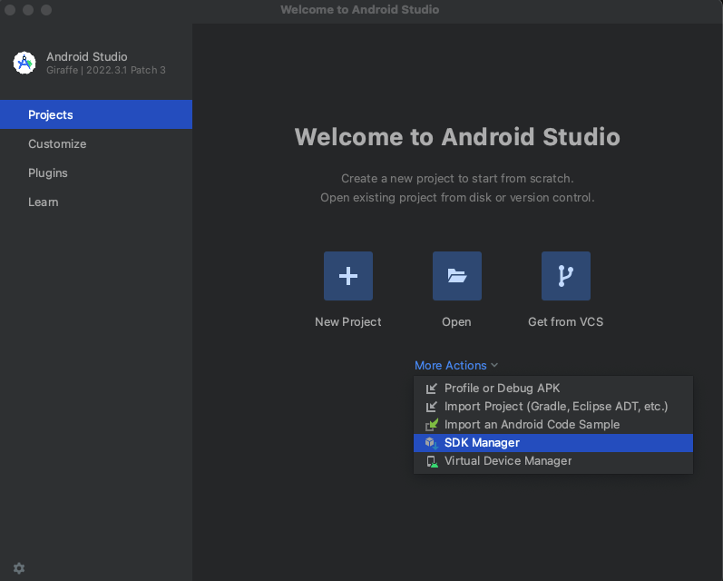
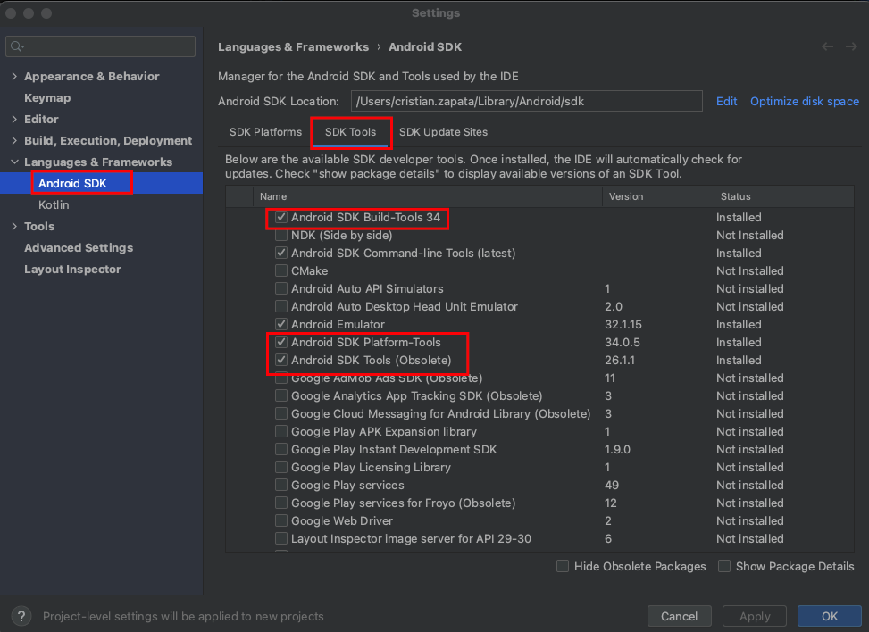
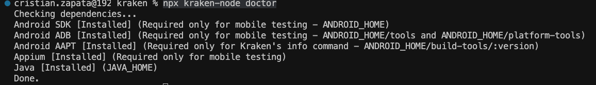

# Bienvenido al Readme de **misw4103-2023-15-pruebas-automatizadas-de-software**

## Intregantes del equipo

|Integrante | Email uniandes | Usuario github |
|-----------|----------------|----------------|
| Jhon Muñoz | je.munozr1@uniandes.edu.co | @icgodmemAndes |
| Cristian Eduardo Parada Criales | c.paradac@uniandes.edu.co | @cparadac |
| Juan Carlos Torres | jc.torresm1@uniandes.edu.co | @jctorresm1 |
| Cristian Camilo Zapata Torres | c.zapatat@uniandes.edu.co | @cczapatat |

## Instrucciones

A continuación se mencionaran pasos, requisitos y consideraciones importantes para correr los escenarios de prueba de los diferentes proyectos en Kraken y Cypress.

### Requisitos Generales

Estos requisitos son aplicables a los escenarios de ambos proyectos (Kraken y Cypress).

* Se requiere tener NodeJs y NPM instalados, aquí recomendamos utilizar [NVM](https://github.com/nvm-sh/nvm), ya que cada proyecto usa una versión diferente de NodeJs.

* Se requiere contar con el aplicativo Ghost en la versión **5.68.0** instalado de forma local.

```bash
ghost install 5.68.0 --local
```

*Si no cuenta con Ghost-Cli instalado puede correr el siguiente comando.*

```bash
npm install ghost-cli@latest -g
```

*Para mayor información sobre como instalar Ghost local puede utilizar la siguiente guia*

[Guia](https://thesoftwaredesignlab.github.io/AutTestingCodelabs/ghost-local-deployment/index.html#0)

* Iniciar Ghost de forma local

```bash
ghost start
```

* Verificar Ghost, al correr el siguiente comando debe observar una tabla en la cual esta la URL donde el aplicativo quedo ejecutandose.

```bash
ghost ls
```

* Ingresar a la URL donde está ejecutandose Ghost y al final de la URL escribir **/ghost**, lo cual es la vista como administrador.

```sh
http://localhost:2368/ghost
```

* Si es la primer vez que ingresa se le solicitará crear un administrador, importante crear el administrador con los siguientes datos, ya que estos son los datos con los que se ejecutan los escenarios. *Si ya tiene un administrador creado debera cambiar las credenciales en los archivos de configuración de cada proyecto*

```json
site: Ghost
name: admin
email: admin@email.com
password: pruebasE2E
```

### Correr pruebas Cypress

#### Requisitos

* NodeJs en versión **18.18.2**
* NPM en versión **9.8.1**
* Cypress en version **13.13.0**

#### Pasos

* Ubicarse en la carpte de *cypress*

```sh
cd cypress
```

* Instalar node en la versión **18.18.2**

```bash
nvm install 18.18.2
```

```bash
nvm use 18.18.2
```

* Instalar Cypress de forma global

```bash
npm install -g cypress
```

* Instalar dependecias del proyecto

```bash
npm install
```

##### Ejecución proyecto Cypress

###### Modo headless

```bash
npx cypress run --browser chrome
```

###### Modo interactivo

```bash
cypress open
```

* Seleccionar E2E
* Agregar el folder de cypress al arbol de proyectos
* Seleccionar el navegador chrome
* seleccionar los escenarios a correr

*Para mayor información sobre como ejecutar un proyecto Cypress puede dirigirse a la siguiente*

[Guia](https://thesoftwaredesignlab.github.io/AutTestingCodelabs/cypress-tutorial/index.html#0)

### Correr pruebas Kraken

#### Requisitos

* NodeJs en versión **16.20.2**
* NPM en versión **8.19.4**
* Kraken en version **1.0.24**

#### Consideraciones

* Tener [Java](https://www.oracle.com/java/technologies/downloads/#java17) en version **17.0.7**
* Tener instalado el [SDK de Android](https://developer.android.com/studio)


* Tener instalado el ADB de Android
* Tener instalado el APPT de Android
* Tener configuradas las variables de JAVA_HOME y ANDROID_HOME ([Link ejemplo](https://stackoverflow.com/questions/28296237/set-android-home-environment-variable-in-mac))
* Tener instalado Appium forma global

#### Pasos

* Ubicarse en la carpte de *kraken*

```sh
cd kraken
```

* Instalar node en la versión **16.20.2**

```bash
nvm install 16.20.2
```

```bash
nvm use 16.20.2
```

* Instalar Kraken de forma global

```bash
npm install kraken-node -g
```

* Instalar dependecias del proyecto

```bash
npm install
```

* Instalar Appium de forma global

```bash
npm install -g appium
```

* Ejecutar el siguiente comando para validar dependencias.

```bash
npx kraken-node doctor
```



*Para mayor información sobre como ejecutar un proyecto Kraken puede dirigirse a la siguiente*

[Guia](https://thesoftwaredesignlab.github.io/AutTestingCodelabs/kraken-web-testing-tool/index.html#0)

* Ejecutar escenarios de prueba

Aquí se propone varios comandos alternativos.

Si esta en una terminal unix, puede ejecutar:

```bash
npm run krakenos
```

Si esta en una terminal windows, puede ejecutar:

```bash
npm run krakenwin
```

Además puede ejecutar, en cualquier tipo de terminal:

```bash
npx kraken-node run
```