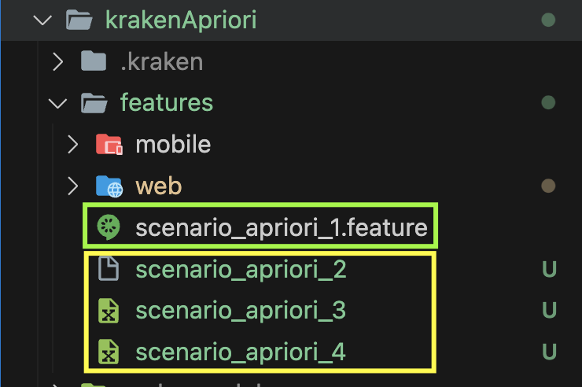

# Bienvenido al Readme de **misw4103-2023-15-pruebas-automatizadas-de-software**

## Intregantes del equipo

|Integrante | Email uniandes | Usuario github |
|-----------|----------------|----------------|
| Jhon Muñoz | je.munozr1@uniandes.edu.co | @icgodmemAndes |
| Cristian Eduardo Parada Criales | c.paradac@uniandes.edu.co | @cparadac |
| Juan Carlos Torres | jc.torresm1@uniandes.edu.co | @jctorresm1 |
| Cristian Camilo Zapata Torres | c.zapatat@uniandes.edu.co | @cczapatat |

<hr/>
<hr/>

## Evidencias Reportes

[Link Semana 7](https://uniandes-my.sharepoint.com/:f:/g/personal/c_zapatat_uniandes_edu_co/EiNMLQU4w3FMnZ1dOy0DnJ4BZLVx14xNykzYMHRTCtMgcQ?e=fMsiFe)

<hr/>
<hr/>

## Instrucciones

A continuación se mencionaran pasos, requisitos y consideraciones importantes para correr los escenarios de prueba y las distribuciones realizadas para el uso de generación de datos.

<hr/>
<hr/>

## Distribución de las estrategias de generación de Datos

### Pool de Datos A-priori

Se generaron **30** escenarios usando el proyecto Kraken y sus bondades de "Scenario Outline" por "Examples".

- [**krakenApriori/features**](https://github.com/cczapatat/misw4103-2023-15-pruebas-automatizadas-de-software/tree/main/krakenApriori/features)

### Pool de Datos (Pseudo) Aleatorio Dinámico

Se generaron **30** escenarios usando el proyecto Cypress y Mokaroo, en donde se crearon 4 Apis.

- [**cypress/cypress/e2e/scenarios/pseudo**](https://github.com/cczapatat/misw4103-2023-15-pruebas-automatizadas-de-software/tree/main/cypress/cypress/e2e/scenarios/pseudo)

### Escenario aleatorio

Se utilizaron los escenarios iniciales de las actividades donde se implemento la herramienta de Faker, donde se hizo una distribución **30** en Cypress y **30** en Krake.

- **cypress/cypress/e2e/scenarios**  (No se incluye la carpeta psedudo ya que pertenece a la estrategia anterior)
- **kraken/features**

<hr/>
<hr/>

### Requisitos Generales

Estos requisitos son aplicables a los escenarios de ambos proyectos (Kraken y Cypress).

* Se requiere tener NodeJs y NPM instalados, aquí recomendamos utilizar [NVM](https://github.com/nvm-sh/nvm), ya que cada proyecto usa una versión diferente de NodeJs.

* Se requiere contar con el aplicativo Ghost en la siguiente versión **5.68.0**.

```bash
docker run -d --name ghost_5.68.0 -e NODE_ENV=development -e url=http://localhost:2368 -p 2368:2368 ghost:5.68.0
```

* Ingresar a la URL donde se ejecuta Ghost y al final de la URL escribir **/ghost**, lo cual es la vista como administrador.

```sh
http://localhost:2368/ghost
```

* Utilice esta misma URL y ajustela en los archivos de configuración de cada proyectos *cypress.config.js* y *kraken.config.js*

* Si es la primer vez que ingresa se le solicitará crear un administrador, importante crear el administrador con los siguientes datos, ya que estos son los datos con los que se ejecutan los escenarios. *Si ya tiene un administrador creado debera cambiar las credenciales en los archivos de configuración de cada proyecto*

```json
{
  "site": "Ghost",
  "name": "admin",
  "email": "admin@email.com",
  "password": "pruebasE2E",
}
```

* Posterior a la instalación de Ghost podra ir a los diferentes aplicativos de Cypress, Kraken y KrakeApriori, en los cuales encontrará  posibles comandos para su ejecución.

<hr/>
<hr/>

### Correr pruebas Cypress

#### Requisitos

* NodeJs en versión **18.18.2**
* NPM en versión **9.8.1**
* Cypress en version **13.3.0**

#### Pasos

* Ubicarse en la carpeta de *cypress*

```sh
cd cypress
```

* Instalar node en la versión **18.18.2**

```bash
nvm install 18.18.2
```

```bash
nvm use 18.18.2
```

* Instalar Cypress de forma global

```bash
npm install -g cypress
```

* Instalar dependecias del proyecto

```bash
npm install
```

##### Ejecución proyecto Cypress

###### Modo interactivo

Lista de comandos:

Unix

```bash
npm run cypressos:new
```

Windows

```bash
npm run cypresswin:new
```

* Seleccionar E2E
* Agregar el folder de cypress al arbol de proyectos
* Seleccionar el navegador chrome
* seleccionar los escenarios a correr

*Para mayor información sobre como ejecutar un proyecto Cypress puede dirigirse a la siguiente*

[Guia](https://thesoftwaredesignlab.github.io/AutTestingCodelabs/cypress-tutorial/index.html#0)

<hr/>
<hr/>

### Correr pruebas Kraken

#### Requisitos

* NodeJs en versión **16.20.2**
* NPM en versión **8.19.4**
* Kraken en version **1.0.24**

#### Consideraciones

* Tener [Java](https://www.oracle.com/java/technologies/downloads/#java17) en version **17.0.7**
* Tener instalado el [SDK de Android](https://developer.android.com/studio)


* Tener instalado el ADB de Android
* Tener instalado el APPT de Android
* Tener configuradas las variables de JAVA_HOME y ANDROID_HOME ([Link ejemplo](https://stackoverflow.com/questions/28296237/set-android-home-environment-variable-in-mac))
* Tener instalado Appium forma global

#### Pasos

* Ubicarse en la carpeta de *kraken*

```sh
cd kraken
```

* Instalar node en la versión **16.20.2**

```bash
nvm install 16.20.2
```

```bash
nvm use 16.20.2
```

* Instalar Kraken de forma global

```bash
npm install kraken-node -g
```

* Instalar dependecias del proyecto

```bash
npm install
```

* Instalar Appium de forma global

```bash
npm install -g appium
```

* Ejecutar el siguiente comando para validar dependencias.

```bash
npx kraken-node doctor
```


*Para mayor información sobre como ejecutar un proyecto Kraken puede dirigirse a la siguiente*

[Guia](https://thesoftwaredesignlab.github.io/AutTestingCodelabs/kraken-web-testing-tool/index.html#0)

* Ejecutar escenarios de prueba

Lista de comandos:

Unix

```bash
npm run krakenos:new
```

Windows

##### Consideraciones

**Para la ejecución en windows dentro de la carpeta features solo se debe tener un archivo con extensión .feature, y solo un feature dentro del mismo archivo**

```bash
npm run krakenwin:new
```

**Para la ejecución de multiples archivos scenario_X.feature en WINDOWS se DEBE ejecutar el siguiente commando que actualiza los nombres de los archivos .feature y se ejecute el commando krakenwin por cada archivo .feature. Si se presenta algún error o cancela el comando, los archivos quedaran renombrados con .featured y sera necesario renombrarlos a su nombre inicial**

```bash
npm run krakenwinmulti:new
```

<hr/>
<hr/>

### Correr pruebas KrakenApriori

#### Requisitos

* NodeJs en versión **16.20.2**
* NPM en versión **8.19.4**
* Kraken en version **1.0.24**

#### Consideraciones

* Aplica las misma consideraciones del proyecto Kraken.

#### Pasos

* Ubicarse en la carpeta de *krakenApriori*

```sh
cd krakenApriori
```

* Instalar node en la versión **16.20.2**

```bash
nvm install 16.20.2
```

```bash
nvm use 16.20.2
```

* Instalar Kraken de forma global

```bash
npm install kraken-node -g
```

* Instalar dependecias del proyecto

```bash
npm install
```

* Instalar Appium de forma global

```bash
npm install -g appium
```

* Ejecutar el siguiente comando para validar dependencias.

```bash
npx kraken-node doctor
```


*Para mayor información sobre como ejecutar un proyecto Kraken puede dirigirse a la siguiente*

[Guia](https://thesoftwaredesignlab.github.io/AutTestingCodelabs/kraken-web-testing-tool/index.html#0)

##### Antes de Correr las pruebas

Para la ejecución de los escenarios en este proyecto es necesario garantizar que solo un archivo tenga la extensión **.feature** al interior de la carpeta **krakenApriori/features**, para esto deberá sobreescribir los archivos contrarios al que desea ejecutar, luego restaurar el nombre y renombrar los contrarios, esto con el fin de cada escenario se ejecute de forma individual y correctamente.



* Ejecutar escenarios de prueba

Lista de comandos:

Unix

```bash
npm run krakenos:new
```

Windows

```bash
npm run krakenwin:new
```
